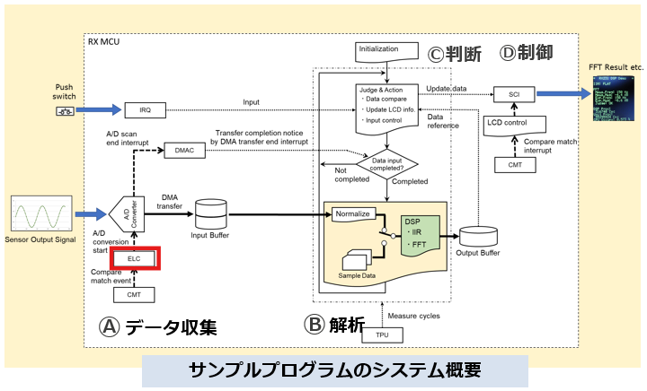

# What is ELC (Event Link Controller)?

The Event Link Controller is a hardware feature in many **Renesas RX MCUs** that allows peripherals to trigger each other **without CPU intervention**.

Instead of:
```
Timer interrupt
    ↓
CPU executes ISR
    ↓
CPU starts ADC conversion
```

you can configure ELC:
```
Timer match event
    ↓
ELC
    ↓
ADC conversion starts automatically
```

This reduces:
- CPU load
- Interrupt overhead
- Response latency
- Power consumption

## What does the ELC Driver do?

The **ELC Driver** is the software layer that configures the Event Link Controller registers.

Typical functions:
```
R_ELC_Create();
R_ELC_Start();
```

The driver is responsible for:
- Enabling ELC
- Selecting event sources
- Selecting destination peripherals
- Configuring event links

For example:
```
CMT timer compare match
        ↓
      ELC
        ↓
     A/D Converter
```
or
```
CMT periodic timer
   ↓
ELC
   ↓
ADC sampling
   ↓
DMA transfer
   ↓
DSP processing
```
